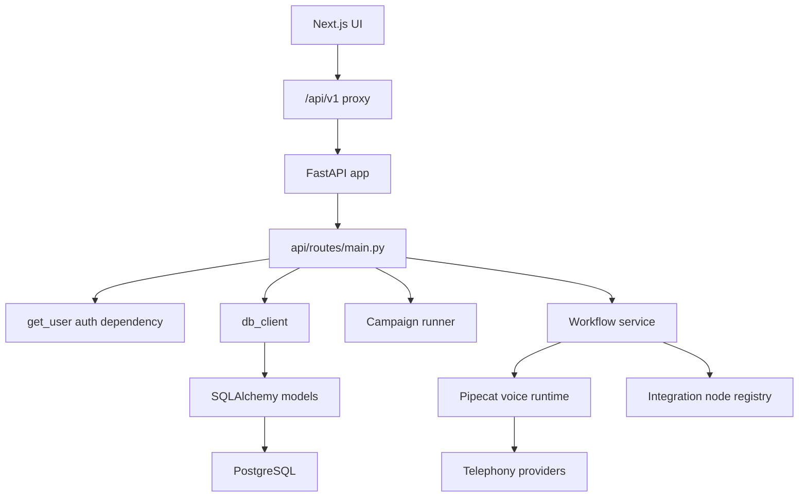

# Dograh Sales OS Implementation Report

## Phase 1 Repository Analysis

Inspected checkout: `work/dograh-main`.

### Top-Level Structure

- `api/`: FastAPI backend.
- `ui/`: Next.js 15, React 19, TypeScript, Tailwind UI.
- `api/db/`: async SQLAlchemy models and specialized DB clients.
- `api/routes/`: REST routers, mounted through `api/routes/main.py`.
- `api/services/workflow/`: workflow graph, DTOs, node specs, Pipecat runtime, custom tools, QA analysis.
- `api/services/integrations/`: auto-discovered integration packages and node registrations.
- `api/services/telephony/`: telephony factory and providers: Twilio, Telnyx, Vonage, Plivo, Cloudonix, Vobiz, ARI.
- `api/services/campaign/`: bulk campaign orchestration, source sync, rate limiting, retry/circuit breaker.
- `api/services/pipecat/`: voice runtime, realtime providers, transport setup, pipeline execution.
- `api/services/auth/`: Stack/local/API-key auth dependency.
- `api/alembic/versions/`: database migrations.
- `ui/src/app/`: app-router pages.

### Dependency Map



### Recommended Integration Points Used

- REST: new router mounted in `api/routes/main.py`.
- Database: additive SQLAlchemy models in `api/db/models.py`.
- DB access: additive `SalesOSClient`, mixed into unified `DBClient`.
- Workflow nodes: additive `api/services/integrations/sales_os` package, auto-discovered by Dograh integration loader.
- UI: additive app route `ui/src/app/sales-os/page.tsx`.

## Phase 2 Technical Architecture

Implemented foundation modules:

- CRM: leads, companies, contacts, pipeline stages, activities.
- Lead Finder: lead-search request endpoint plus lead-finder agent run tracking.
- Research: research reports attached to leads.
- Campaigns: `sales_campaign_leads` join table connecting Sales OS leads to existing Dograh campaigns.
- Calls: call records linked to leads, campaigns, and Dograh workflow runs.
- Call Intelligence: transcript and insight tables.
- Qualification: score/classification persisted on leads.
- Analytics: aggregate endpoint for agency dashboard metrics.
- Knowledge Base: Sales-specific knowledge sources linked optionally to existing Dograh KB documents.
- Agent Runs: durable agent run audit table.

## Phase 2 Database Design

Tables added:

- `sales_companies`
- `sales_leads`
- `sales_contacts`
- `sales_pipeline_stages`
- `sales_campaign_leads`
- `sales_calls`
- `sales_call_transcripts`
- `sales_call_insights`
- `sales_activities`
- `sales_meetings`
- `sales_follow_ups`
- `sales_research_reports`
- `sales_knowledge_sources`
- `sales_agent_runs`

Core relationships:

- `sales_leads.organization_id -> organizations.id`
- `sales_leads.company_id -> sales_companies.id`
- `sales_campaign_leads.campaign_id -> campaigns.id`
- `sales_campaign_leads.lead_id -> sales_leads.id`
- `sales_calls.workflow_run_id -> workflow_runs.id`
- `sales_calls.campaign_id -> campaigns.id`
- `sales_calls.lead_id -> sales_leads.id`
- `sales_call_transcripts.call_id -> sales_calls.id`
- `sales_call_insights.call_id -> sales_calls.id`
- `sales_research_reports.lead_id -> sales_leads.id`
- `sales_knowledge_sources.knowledge_base_document_id -> knowledge_base_documents.id`
- `sales_agent_runs.workflow_run_id -> workflow_runs.id`

Indexes were added for organization scoping, pipeline queries, campaign queue state, call lookup, lead search fields, classification analytics, and scheduled follow-ups.

## Phase 3 Folder Structure

Implemented files:

```text
api/
├── alembic/versions/a91c4f2d8b10_add_sales_os_tables.py
├── db/
│   ├── db_client.py
│   ├── models.py
│   └── sales_os_client.py
├── routes/
│   ├── main.py
│   └── sales_os.py
├── schemas/
│   └── sales_os.py
└── services/integrations/sales_os/
    ├── __init__.py
    └── node.py

ui/
└── src/app/sales-os/page.tsx
```

Recommended next module expansion:

```text
api/sales_os/
├── agents/
├── lead_finder/
├── research/
├── qualification/
├── call_intelligence/
├── analytics/
└── integrations/
```

## Phase 4 API Design

Implemented routes under `/api/v1/sales-os`, all authenticated with Dograh `get_user`:

- `POST /lead-finder/search`
- `POST /leads`
- `GET /leads`
- `GET /leads/{lead_id}`
- `PATCH /leads/{lead_id}`
- `DELETE /leads/{lead_id}`
- `POST /campaigns/{campaign_id}/leads`
- `POST /research/reports`
- `POST /calls`
- `POST /calls/intelligence`
- `POST /knowledge-sources`
- `GET /knowledge-sources`
- `GET /analytics`

Validation is defined in `api/schemas/sales_os.py`.

## Phase 5 Workflow Nodes

Registered Dograh integration nodes:

- `sales_find_leads`
- `sales_enrich_lead`
- `sales_research_company`
- `sales_create_crm_lead`
- `sales_launch_campaign`
- `sales_start_call`
- `sales_analyze_call`
- `sales_qualify_lead`
- `sales_book_meeting`
- `sales_update_pipeline`
- `sales_schedule_follow_up`

Each node includes typed inputs, UI metadata, graph constraints, and node catalog registration.

## Phase 6 Agent Design

Implemented persistence support for five agents through `sales_agent_runs`:

- Lead Finder Agent
- Research Agent
- Sales Caller Agent
- Follow-Up Agent
- CRM Agent

Runtime execution hooks should be added next as background tasks or integration completion handlers. The API already records queued agent runs and associated inputs.

## Phase 7 Implementation Status

Completed in this pass:

- Database models.
- Alembic migration.
- Backend DB client.
- REST API routes.
- Workflow node registration.
- Sales OS dashboard page.
- Lead Finder form.
- CRM lead table.
- Analytics cards.

Verification:

- `python -m compileall api` passed.
- Frontend lint could not run because `node_modules` are not installed in this checkout.
- Runtime import checks could not run because Python dependencies are not installed in this checkout.
